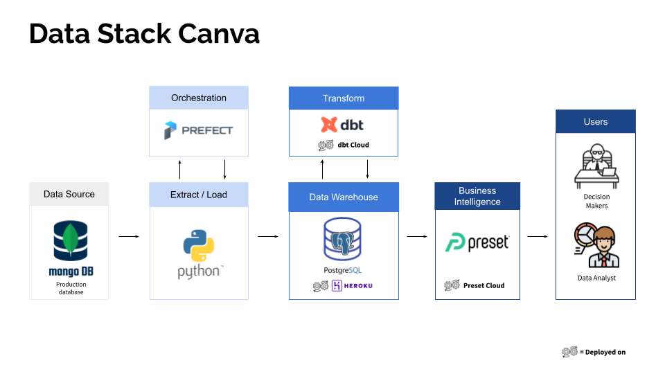

# Analytics La Porte Bleue
> Modern Data Stack for a Charity

Get started with a cost-effective modern data stack using this repo. 
Read more about the project in my blog post [here]().

This repo helps bootstrap the infrastructure of a charity's modern data stack known as La Porte Bleue.
## Architecture

1. Ingestion: **Python** (PyMongo & SQLModel)
2. Orchestration: **Prefect**
3. Warehousing: **Heroku Postgres**
4. Transform: **dbt**
5. Business Intelligence: **Preset**
